# WEB STACK IMPLEMENTATION LEMP STACK

Welcome back! In project one, we focused on deploying the LAMP stack, in this project we'll hone in on LEMP. The term LEMP is an acronym that represents:

**L** –– Linux Operating System >> An operating system that manages all of the hardware resources associated with your desktop or laptop, a.k.a., the communication between your software and hardware

**E** –– Nginx Server **(pronounced as engine-x)** >> A high-preforming web server that enables the processing of many requests at the same time

**M** –– MySQL Database >> An open-source relational database management system

**P** –– PHP (Hypertext Preprocessor)

The Nginix server used in this project, is the main difference in LEMP versus LAMP.

## LINUX

### Setting up your virtual environment

We'll need an AWS account and a virtual server with Ubuntu Server OS. If you don't have one already, follow the steps in my [LAMP Stack](https://github.com/eakanbi80/web-stack-implementation-lamp) project to create a free tier AWS account.


Once you have successfully signed-in to your AWS account, navigate to the top-right of the screen and select your preferred region––this should be the closest region to your physical location.


You'll then want to navigate to the search bar and type in 'EC2.' Select the EC2 service that appears on top.


Click on the 'Launch Instances' button that appears in the top right side of your screen.


Proceed by selecting the Ubuntu Server 20.04 LTS (HVM) option as the Amazon Machine Image (AMI).


On the following page, locate and select t2.micro as the instance type and click 'Review and Launch.'


Next, click on 'Launch' at the bottom of the screen.


A window should appear asking you to create a key pair. Make sure you create one and then select 'Download Key Pair.' **It's important to know the location the file was downloaded to not lose the .pem file. You will need this file in order to connect into your server from your local PC. After you've downloaded the key pair, check the box for the acknowledgement, and then click on "Launch Instances".**


Awesome, you've successfully launched an EC2 instance!


To view your new instance, click the 'View Instances' button at the bottom-right of the screen.


# Connecting to your EC2 from your local PC

**FRIENDLY REMINDER**–– Anchor tags(< >) will be used to indicate contents that must be replaced with your unique values. For example, if you have a file named "keypair123.pem" you must enter this information within the corresponding anchor tag: < private-key-name >

Let's connect to our instance!

Begin by opening Terminal. Once you have opened Terminal, use the 'cd' command to change into the directory that your key pair is located. This is usually the ~/Downloads directory. If you are having difficulty finding it, you can use the 'ls' command to list the contents of your current directory.

Once you have located the key pair, use the command below to activate the key file (.pem). This command will also change permissions (otherwise you may get the error “Bad Permissions”):
```
$ sudo chmod 0400 .pem When prompted, type the password for your local PC and press Enter on your keyboard.
```

When prompted, type the password for your local PC and press Enter on your keyboard.

Next, go back to the AWS console for a moment, and navigate to your running EC2 instance. Copy the Public IP address, as shown in the image below:


Once you have copied the Public IP address, head back to your terminal. You'll want to connect to the EC2 instance by using the following command:

```
ssh -i <Your-private-key.pem> ubuntu@<EC2-Public-IP-address>
```

You will be asked if you want to continue connecting. Type 'Yes' and press 'Enter' on your keyboard.


When connected, your ip-address will be shown on your terminal.


# Installing the Nginx Web Server

Employing Nginx, a high-performance web server, will help us to display web pages to site visitors. First, we'll need to use the apt package manager to install this package. Run the following commands below to get Nginx installed:

```
$ sudo apt update
```


Install Nginx by following the command below:

```
$ sudo apt install nginx
```
When prompted, enter 'Y' to confirm installation.


To verify that your installation was successful and Nginx is now running on your Ubuntu server run the follwing command on your terminal:

```
$ sudo systemctl status nginx
```

If there is a green dot, then you've completed all steps successfully, and it's running.


Prior to receiving any traffic by our Web Server, we need to open TCP port 80––This is the default port that web browsers utilize in order to access web pages on the Internet.

The EC2 instance on the AWS console we created earlier, opened the TCP port 22 by default. This allowed us to access the EC2 via SSH in Terminal. Now, we must add a rule to the security groups of our EC2 configuration, in order to allow inbound connections through port 80.

Open the AWS Management Console. Click on the security group tab and edit the inbound rules of the running EC2 instance.


Click on Edit Inbound Rules


Click on 'Add Rule' and add the HTTP, TCP port 80 and allow source from anywhere by using 0.0.0.0, allowing traffic from any IP address to enter.


Our server is now running and we can access it locally and from the Internet. We'll now test to see whether or not we can receive traffic. Run the following command to request our Nginx on port 80:
```
$ curl http://localhost:80
```


Now we'll test and verify our Nginx server access, using the public IP address of the EC2 instance via web browser.

```
http://<Public-IP-Address>:80
```

The following screenshot is an example of how the Nginx web default page should look like, if no hiccups have been made.


# Installing MySQL

Now that our web server Nginx is up and running, we'll focus on installing MySQL. MySQL is a popular relational database management system used within PHP environments, so we will use it in our project. First, we're going to install a Database Management System (DBMS) to be able to store and manage data for our site in a relational database.

plug in the command to install MySQL:

```
$ sudo apt install mysql-server
```

When asked, confirm that you want to proceed with the installation by typing Y for "Yes", and then press 'Enter' on your keyboard.


Once the installation is complete, run a security script in order to add more security access to the database system. The following command will help you do so:

```
$ sudo mysql_secure_installation
```

When asked to validate password component. Type 'Y' for Yes.

After, choose the level of your password validation. There are three levels of password validation policy:

Choose either 0 = LOW, 1 = MEDIUM or 2 = STRONG


Once you've set a password for the MySQL root user, type 'Y' for Yes and press 'Enter' on your keyboard at each prompt.

These security measures will remove anonymous users and the test database, disable remote root logins, and then reload these new rules so that the changes will be reflected on the MySQL database.


Next, test if you’re able to log in to the MySQL console by typing the following command:

```
$ sudo mysql
```

The command above will connect to the MySQL server as the administrative database user root. You should expect to see an output like this:


To exit the MySQL console, follow the command:

$ mysql> exit

# Installing PHP

Now that we have Nginx installed to serve our content and MySQL installed to store and manage your data, we can install PHP to process code and generate dynamic content for the web server.

PHP is general-purpose scripting language which processes code so that it can display dynamic content to the end user. It's imperative that Nginx has an external program to handle PHP processing and act as a bridge between the PHP interpreter and the web server. This will allow for a better overall performance in most PHP-based websites, but will require additional configuration.

Let's begin with running these two commands at once on our terminal:
```
$ sudo apt install php-fpm php-mysql
```

When prompted, type 'Y' and press 'Enter' to confirm installation.

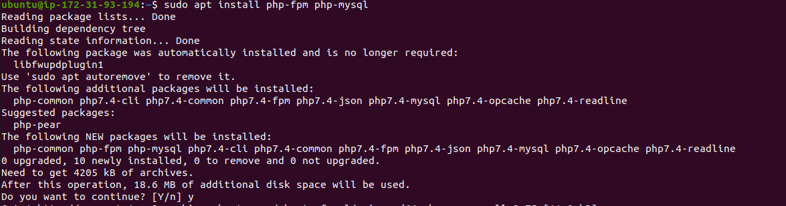

PHP is now completely installed and good to go!

# Configuring Nginx to Use PHP Processor

Now that we have the PHP components installed, next, we'll configure Nginx to use them.

Using the Nginx web server enables us to create server blocks to host multiple domains on a single server. On Ubuntu 20.04, Nginx already has a default server block at /var/www/html. Rather than alternating this block, we will create a new directory structure using 'projectLEMP' as the domain name.

Create the directory for projectLEMP using 'mkdir' command:

```
$ sudo mkdir /var/www/projectLEMP
```
After, assign ownership of the directory using the following command:

```
$ sudo chown -R $USER:$USER /var/www/projectLEMP
```

Next, create and open a new configuration file using nano (a text editor). Use the command below to open a blank file:

$ sudo nano /etc/nginx/sites-available/projectLEMP

Paste in the following configuration:

#/etc/nginx/sites-available/projectLEMP

```server {
    listen 80;
    server_name projectLEMP www.projectLEMP;
    root /var/www/projectLEMP;

    index index.html index.htm index.php;

    location / {
        try_files $uri $uri/ =404;
    }

    location ~ \.php$ {
        include snippets/fastcgi-php.conf;
        fastcgi_pass unix:/var/run/php/php7.4-fpm.sock;
     }

    location ~ /\.ht {
        deny all;
    }

}
```

Once you have finished editing, save (CTRL+O) and close the file using CTRL+X and then 'Y' and 'ENTER' to confirm. Your output should look like below:

Here’s what each of these directives and location blocks do:

- ```***listen***```— Defines what port Nginx will listen on. In this case, it will listen on port 80, the default port for HTTP.

- ```***root***``` — Defines the document root where the files served by this website are stored.

- ```***index***``` — Defines in which order Nginx will prioritize index files for this website. It is a common practice to list index.html files with a higher precedence than index.php files to allow for quickly setting up a maintenance landing page in PHP applications. You can adjust these settings to better suit your application needs.

- ```***server_name***``` — Defines which domain names and/or IP addresses this server block should respond for. ***Point this directive to your server’s domain name or public IP address.***

- ```***location /***``` — The first location block includes a try_files directive, which checks for the existence of files or directories matching a URI request. If Nginx cannot find the appropriate resource, it will return a 404 error.

- ```***location ~ \.php$***``` — This location block handles the actual PHP processing by pointing Nginx to the fastcgi-php.conf configuration file and the php7.4-fpm.sock file, which declares what socket is associated with php-fpm.

- ```***location ~ /\.ht***``` — The last location block deals with .htaccess files, which Nginx does not process. By adding the deny all directive, if any .htaccess files happen to find their way into the document root ,they will not be served to visitors.

Now, let's activate our configuration so that Nginx will use this the next time it is reloaded. We can do this by using a series of commands:

```
$ sudo ln -s /etc/nginx/sites-available/projectLEMP /etc/nginx/sites-enabled/
```
This will tell Nginx to use the configuration next time it is reloaded. We can test our configuration for syntax errors by typing:

```
$ sudo nginx -t
```
The following message should appear:

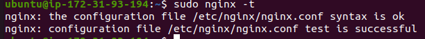

We must also disable the default Nginx host. Use the following command:

```
sudo unlink /etc/nginx/sites-enabled/default
```

Next, reload Nginx to apply the changes:

```
$ sudo systemctl reload nginx
```
Great! Our new website is now active. The web root /var/www/projectLEMP, however, is still empty. We'll next create an index.html file, so that we can test that our new server block is functioning properly. Use the command below:

```
sudo echo 'Hello LEMP from hostname' $(curl -s http://169.254.169.254/latest/meta-data/public-hostname) 'with public IP' $(curl -s http://169.254.169.254/latest/meta-data/public-ipv4) > /var/www/projectLEMP/index.html
```
Now that the index.html has been added, visit your browser and access the website URL using the IP address:

```
http://<Public-IP-Address>:80
```
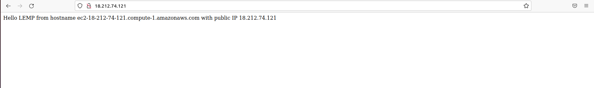

Woohoo! We have now fully congirured our LEMP stack.

# Testing PHP with Nginx

We've completed setting up the LEMP stack! Great work! In order to test if Nginx can manage the .php files from our newly configured website, we'll need to create a PHP script. Let's open a new file called info.php within our document root.

```
`$ nano /var/www/projectLEMP/info.php`
```

Once a new file opens up, enter in the command below. This PHP code will return information about your server.

```
<?php
phpinfo();
```

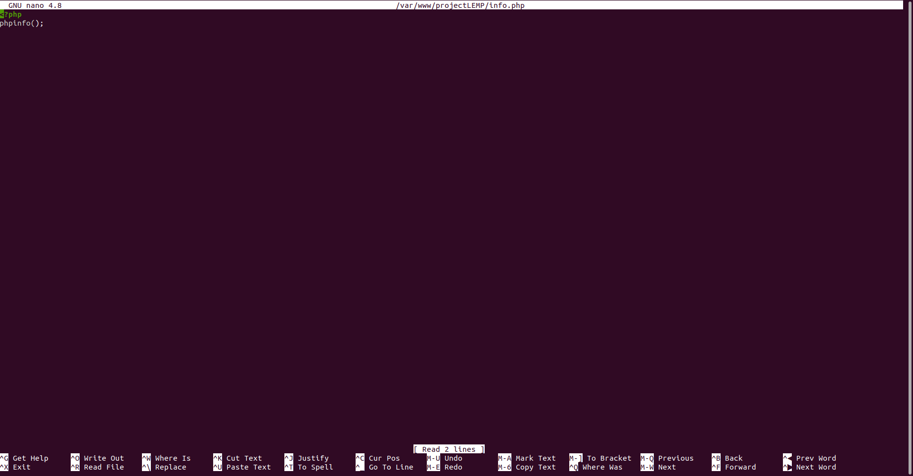

Make sure to save (CTRL+O), then close the file using CTRL+X, 'Y,' and then 'ENTER'.

We can now head back to our web browser by using the public IP address we set up in our Nginx configuration file.

A web page should appear like the one below:

`http://`server_domain_or_IP`/info.php`

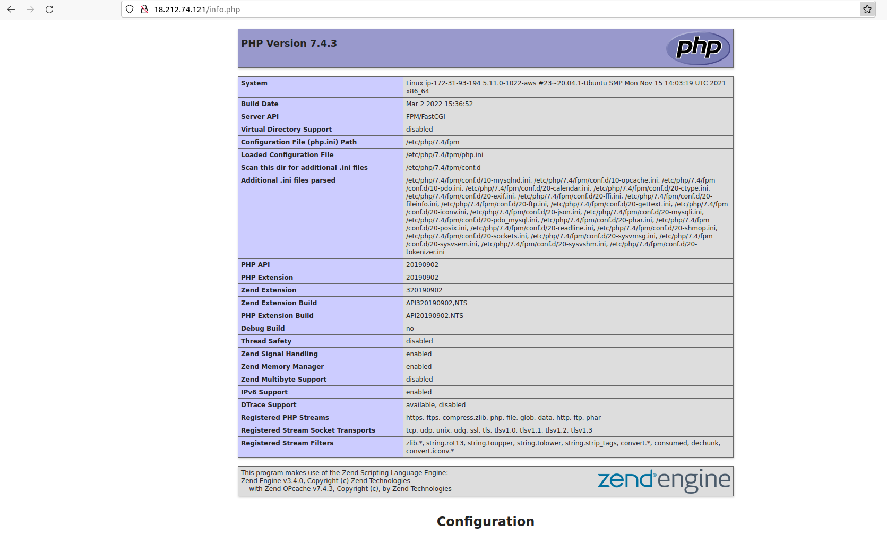

Once you see that everything appears as should be, make sure to remove the file you created, as it contains sensitive information about your PHP environment and your Ubuntu server.

Use the following code below:

```
`$ sudo rm /var/www/your_domain/info.php
```
This file can always be recreated at a later time, if needed.

# Retrieving data from MySQL database with PHP

In our last step, we're going to create a test database (DB) with simple “To do list” and configure it's accessibility. Doing this will allow the Nginx website to be able to query data from the DB and display it.

Let's create a database named example_database and then create a user named example_user.

```
$ sudo mysql
```

create a new database using the following command:

```
mysql> CREATE DATABASE `example_database`;
```

Now let's create a new user and grant them full privileges on the database we just created.

The command below creates a new user named example_user, using mysql_native_password as default authentication method. For the purposes of this example, our user’s password will be 'password,' but make sure to replace this value with a secure password of your own choosing.

```
mysql>  CREATE USER 'example_user'@'%' IDENTIFIED WITH mysql_native_password BY 'password';
```

Okay, great! Now we need to give this user permission over the example_database database:

```
mysql> GRANT ALL ON example_database.* TO 'example_user'@'%';
```
While they have permission over the database, they'll be restricted from creating or modifying other databases on the server.

Exit the MySQL shell using the following command:

```
mysql> exit
```

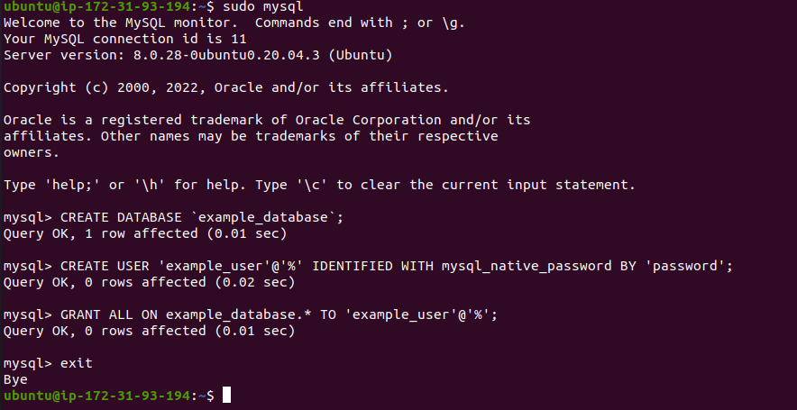

Let's test whether the example_user has the permissions by logging back into to the MySQL console using the following command:

```
`$ mysql -u example_user -p`
```
Please Note: The '-p' in the command above, will prompt you for the password used when creating the example_user user.

After logging in to the MySQL console, confirm that you have access to the example_database database:

```
mysql> SHOW DATABASES;
```

This will give you the following output:

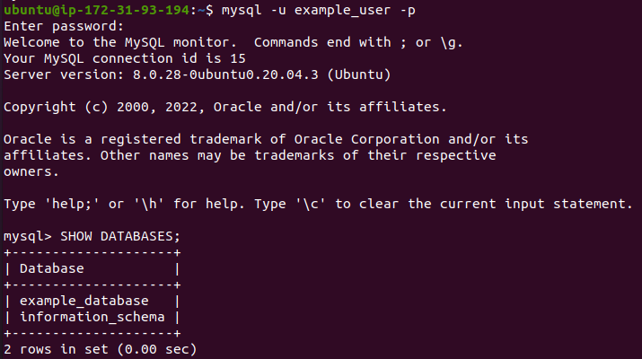

Let's also create a test table named todo_list. From the MySQL console, run the following statement:

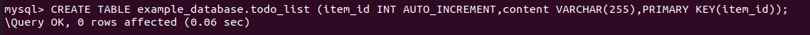

After, Include a few rows of content in the test table. I recommended repeating the next command a few times, using different VALUES:
```
mysql> INSERT INTO example_database.todo_list (content) VALUES ("My first important item");
```

In order to confirm whether the data was successfully saved to your table, use the following command:
```
mysql>  SELECT * FROM example_database.todo_list;
```
You’ll see the following output:

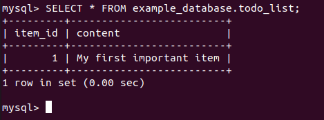

Once you're able to confirm that you have valid data in your test table, exit the MySQL console:

```
mysql> exit
```

Nice! Now we're able to create a PHP script which we can use to connect to MySQL and query our content.

Create a new PHP file in your custom web root directory using nano:

```
$ nano /var/www/projectLEMP/todo_list.php
```

Let's connect the following PHP script to the MySQL database and queries for the content of the todo_list table, that outputs the results in a list. You'll know if there is a problem with the database connection, if an exception is thrown.

```
<?php
```

$user = "example_user"; $password = "password"; $database = "example_database"; $table = "todo_list";

try { $db = new PDO("mysql:host=localhost;dbname=$database", $user, $password); echo "

You’ll see the following output:

# TODO

The following PHP script connects to the MySQL database and queries for the content of the todo_list table, displays the results in a list. If there is a problem with the database connection, it will throw an exception.

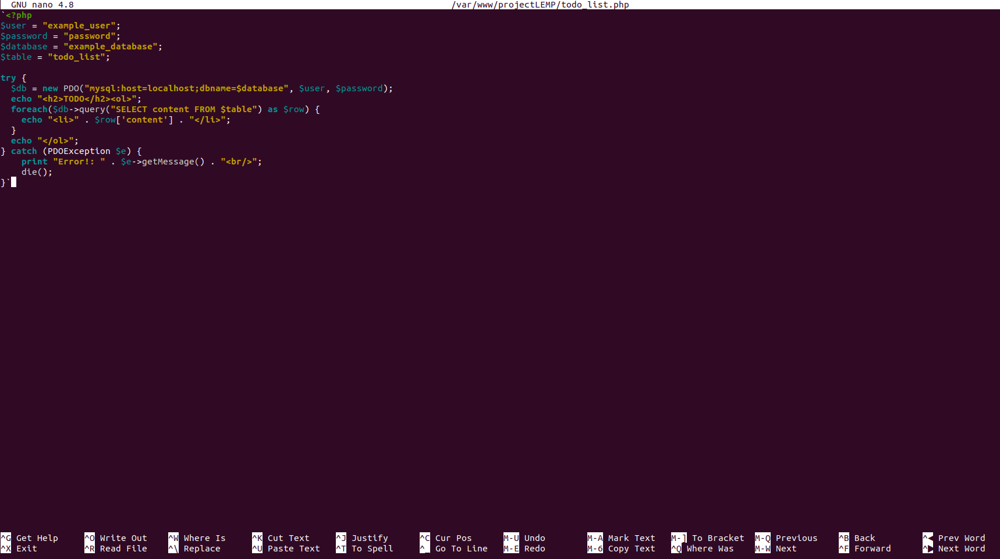

Save and close the file once you're done editing.

You can now access this page in your web browser by visiting the public IP address configured for your website, with the following command:

```
http://<EC2-Public-IP-address>/todo_list.php
```

You should see a page like the one below, showing the content you’ve inserted in your test table:

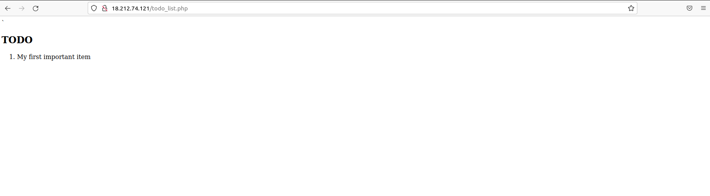

This means our PHP environment is ready to connect and interact with your MySQL server.

Congratulations! We have now successfully completed the web stack implementaion using LEMP!